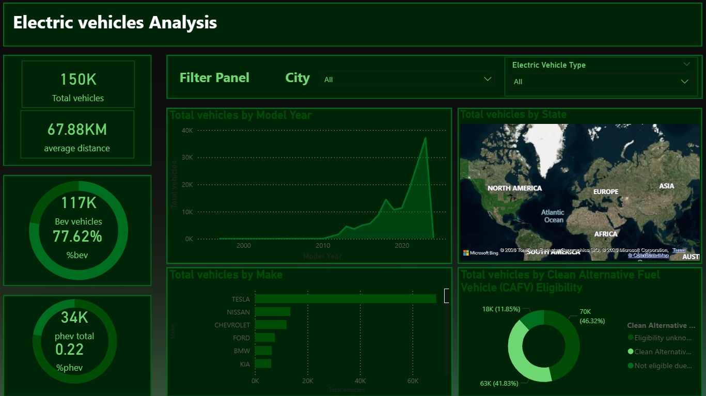

# ⚡ Electric Vehicles Analysis Dashboard

An interactive Power BI dashboard analyzing the electric vehicle population — covering adoption trends over time, BEV vs PHEV breakdowns, geographic distribution across U.S. states, and top manufacturers.

---

## 📸 Preview

> _Add a screenshot here: replace the line below with your image_



---

## 📊 Dashboard Overview

**Tool:** Power BI Desktop  
**File:** `vehicles_analysis.pbix`  
**Pages:** 1 (Page 1)

### KPI Cards
| Metric | Description |
|--------|-------------|
| Total Vehicles | Total count of registered electric vehicles |
| Average Range | Average electric range across all vehicles |
| BEV Total | Total Battery Electric Vehicles |
| % BEV | BEV share of total EV fleet |
| PHEV Total | Total Plug-in Hybrid Electric Vehicles |
| % PHEV | PHEV share of total EV fleet |

### Visuals
| Visual | Type | Fields |
|--------|------|--------|
| EV Type Split | Donut Chart | Electric Vehicle Type, Total Vehicles |
| CAFV Eligibility | Donut Chart | CAFV Eligibility Status, Total Vehicles |
| EV Growth Over Time | Line Chart | Model Year, Total Vehicles |
| Geographic Distribution | Filled Map | State, Total Vehicles |
| Top Manufacturers | Clustered Bar Chart | Make, Total Vehicles |

### Filters / Slicers
- **City** — filter all visuals by city
- **Electric Vehicle Type** — toggle between BEV, PHEV, or both

---

## 🗂 Data Source

**Dataset:** Electric Vehicle Population Data  
**Entity:** `Electric_Vehicle_Population_Data`  
**Source:** [Washington State Department of Licensing – EV Population Data](https://data.wa.gov/Transportation/Electric-Vehicle-Population-Data/f6w7-q2d2)

Key columns used:
- `Model Year`
- `Make`
- `State`
- `City`
- `Electric Vehicle Type` (BEV / PHEV)
- `Clean Alternative Fuel Vehicle (CAFV) Eligibility`
- `Electric Range`

---

## 🔍 Key Findings

- **BEV vehicles dominate** the fleet, making up the majority of registered EVs
- **Growth accelerates** significantly from 2018 onward based on model year trends
- A handful of **top manufacturers** account for the bulk of EV registrations
- Geographic distribution shows strong **state-level concentration** in certain regions
- A notable portion of vehicles qualify for **Clean Alternative Fuel Vehicle (CAFV)** incentives

---

## ▶️ How to Open

1. Download and install [Power BI Desktop](https://powerbi.microsoft.com/desktop/) (free)
2. Clone or download this repo
3. Open `vehicles_analysis.pbix` in Power BI Desktop

```bash
git clone https://github.com/YOUR_USERNAME/data-visuals.git
cd data-visuals/electric-vehicles
# Then open vehicles_analysis.pbix in Power BI Desktop
```

---

## 📂 Folder Structure

```
electric-vehicles/
├── README.md
├── vehicles_analysis.pbix     ← Power BI source file
├── data/
│   └── electric_vehicle_population_data.csv
└── assets/
    └── preview.png            ← dashboard screenshot
```
